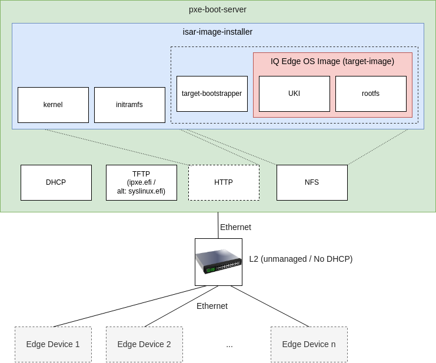

# Installer

The pxe boot based installer is an image serving as either an virtual or physical appliance
to bootstrap, deploy and configure multiple devices at once. Therefore, it uses pxe boot to chainload ipxe firmware to finally bootstrap the actual installer image.

The image installer then deploys the target image to the device and will also execute additional steps (e.g. disk encryption, secure boot key enrollment, device onboarding) in future releases.




In the default setup the `pxe-boot-server` is built for `virtualbox` and it ships with an `DHCP` and `TFTP` server set up for `pxe boot`, `ipxe.efi` to bootstrap ipxe an `HTTP` server to host `ipxe bootfiles` (specifying which kernel, initramfs and kernel-cmdline to use). The core `rootfs` of the installer image with the target image embedded is served via `NFS`.

> Hint: If you are facing issues with some network cards on certain devices ipxe bootstrapping can be bypassed when appending the `pxe-syslinux` OVERRIDE! In that case the installer's kernel and initramfs will be served via TFTP directly (which is way slower than if served via http with ipxe)!

## Process

### Network Boot

1. The edge device's UEFI is set to boot via network using pxe boot. (By default this should be the boot method with highest priority on our devices)
1. The edge device(s) broadcast a dhcp request asking for the address of DHCP servers. In the same packet, it also specifies that it is looking for pxe boot servers.
1. The dhcp server on the `pxe-boot-server` machine responds with an DHCP offer
1. This tells the client that the server responding is an server providing network boot capabilities.
1. Afterwards, the edge device requests an IP address.
1. The DHCP server responds the IP address that is assigned to it.
1. The clients sends the PXE server a request asking for the path to the Network Boot Program (either ipxe.efi (to network boot via http) or syslinux.efi (to network boot via tftp)).

#### ipxe:

By default we are bootstrapping an ipxe bootloader via pxe boot.
Specifically this is the ipxe.efi which enables us to load the larger boot artifacts like kernel and initramfs via http.

> Note: This reduces download times (from server) considerably!

1. ipxe.efi is downloaded via tftp and executed as a second stage boot loader in UEFI
1. The ipxe.efi has a url embedded specifying where ipxe.efi can find the actual boot script.
1. The boot script is hosted on the pxe-boot-server's http server under `http://192.168.42.1/bootfiles/ default.ipxe`
1. This script specifies the commands to be executed in ipxe
    1. the address on the http server where to load the kernel from
    1. the address on the http server where to load the initramfs from
    1. the kernel cmdline used to start the kernel
    1. and finally boots the kernel

#### Optional: syslinux.efi

In cases where ipxe does not work `syslinux.efi` bootstrapping can be configured (`OVERRIDE .= ":pxe-syslinux"`).

1. It downloads the pxelinux config used in syslinux pxe implementation to specify the path to the  kernel and initramfs on the tftp server, and the boot arguments like the kernel cmdline.
1. it downloads and loads the kernel and initramfs into memory
1. it boots the kernel using the specified kernel cmdline

## Build

```
PXE_TARGET_MACHINE="<your-machine>" kas build kas-pxe-boot.yml
```

Set the `MACHINE` of your desired target in `PXE_TARGET_MACHINE`.

You find the pxe server image under 
`build/tmp-pxe-boot-server-vmware/deploy/images/${MACHINE}/pxe-boot-server-debian-bookworm-${MACHINE}.
{wic,ova}`

By default that's:
`build/tmp-pxe-boot-server-vmware/deploy/images/vmware/pxe-boot-server-debian-bookworm-vmware.
ova`
