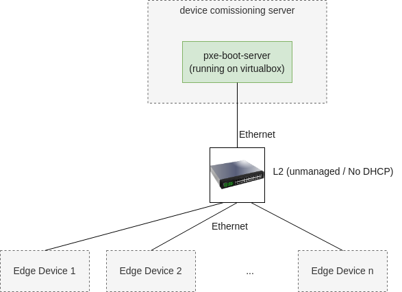
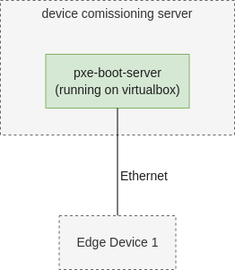
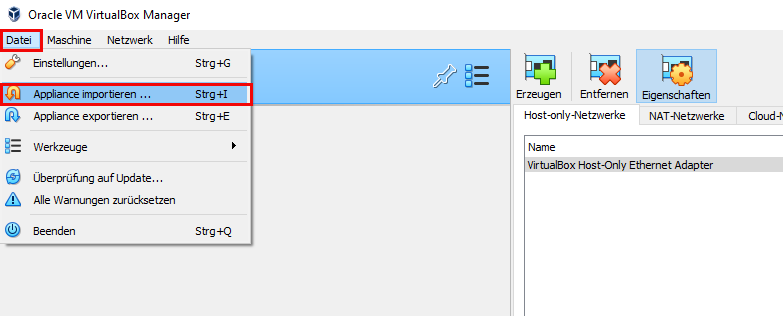
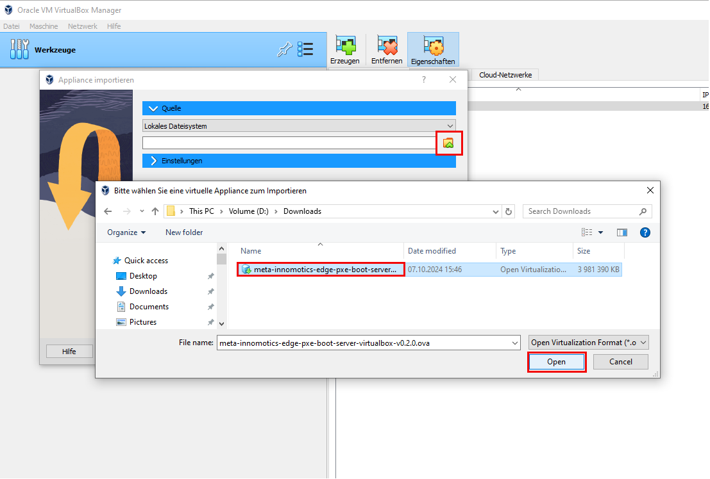
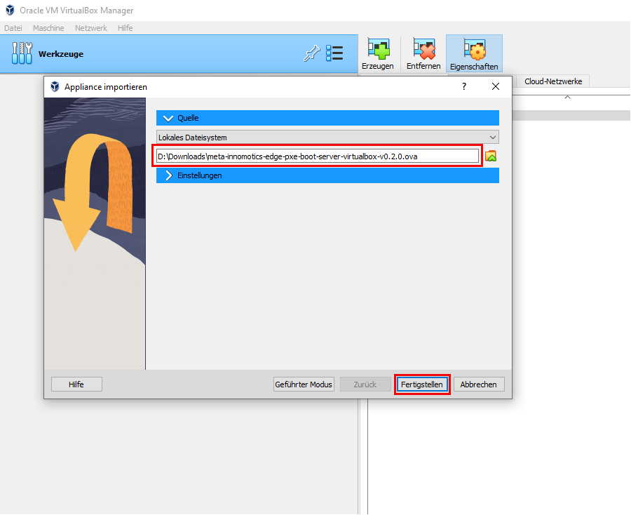
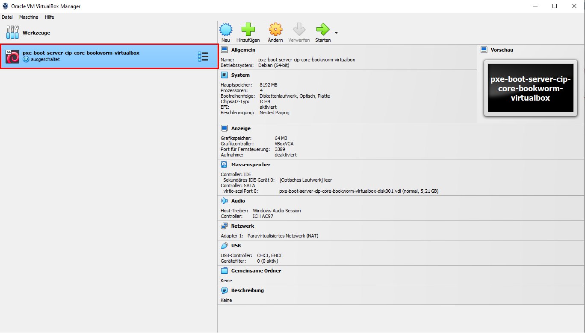
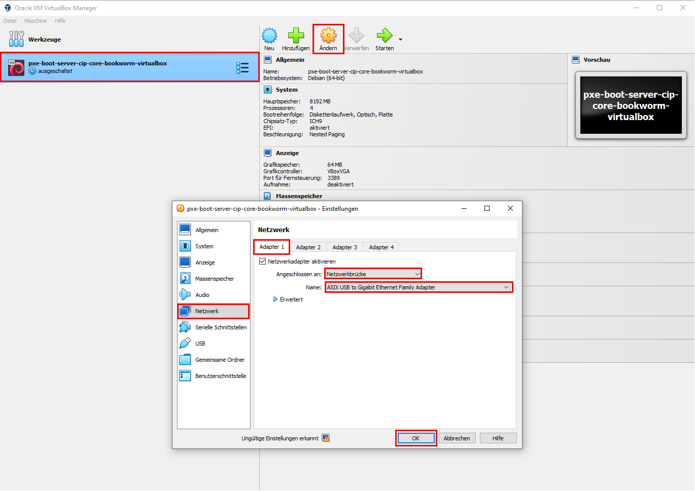
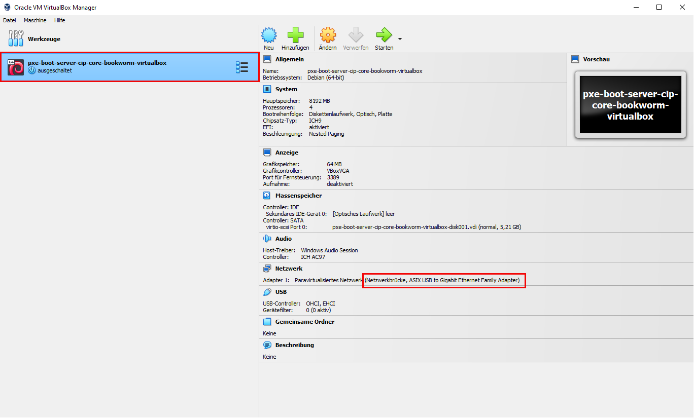
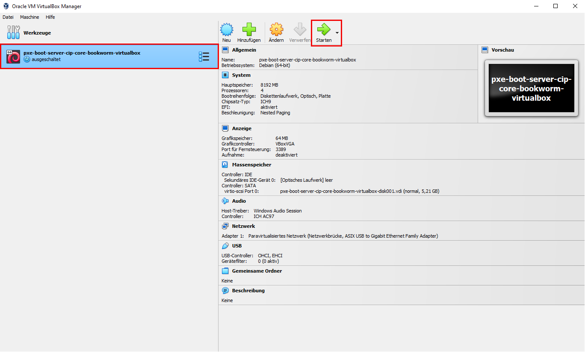

# Quickstart for PXE Boot Installer with VMWare

## Prerequisites

1. Install VMWare on your PC.

    > The installer was tested using VMWare Workstation (17.6.3)

1. Build the image:

    > Note: we are using `vmware` as target as well. Feel free to change that to your target `MACHINE`

    ```
    PXE_TARGET_MACHINE="vmware" kas build .yaml
    ```

1. Open the image `build/tmp-pxe-boot-server-vmware/deploy/images/vmware/pxe-boot-server-debian-bookworm-vmware.ova`

1. Run it

## Network Setup

There are two options to connect the devices with the pxe-boot-server vm.

Either, multiple devices at once via a switch, or a single device directly.

No matter how you chose to connect, **make sure there is no other DHCP server** interfering with the one deployed on the pxe-boot-server vm!

### Option 1: Multiple Devices at once (recommended for production)



### Option 2: Single Device (for smaller rollouts and testing)



## Virtual Machine Setup

1. Start VirtualBox and Import an Appliance



1. Select the `.ova` file downloaded



1. Press Apply



1. Now the imported virtual machine shows up in the list of available virtual machines



1. Change the network settings to bridged mode and select the network adapter you used to connect to the devices (either directly or via the switch)



1. Check the settings



1. Start the virtual machine




## Device Setup

Connect a network cable to the device and power it on.
By default the devices boot order is:

1. Boot from disk
1. Boot from Network
1. Boot from USB Stick

As long as there is no previous os installed, the device tries to boot via network / pxe boot. Thus, connecting to our `pxe-boot-server` running inside VirtualBox!

As soon as the bootstrapping of the target device was successfully, the image is deployed to the disk on the device and after a reboot (which is triggered automatically after bootstrapping) the device boots from disk.

> Note: Booting from USB Stick, does not play a role here and is just for recovery use cases in the field.